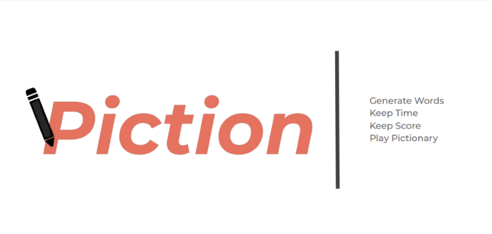

[Google Play store link](https://play.google.com/store/apps/details?id=app.ncore.piction&hl=en_US&gl=US)
## About the App
Piction was the first mobile app I ever developed. I was new to Java and app development at the time as I was just a sophomore in highschool. 
I was trying to play pictionary with my family and realized there wasn't a good app for it so I built this.
### Description
Piction organizes gameplay of the word drawing and guessing game, Pictionary. No timer, boardgame, or word cards needed--just your phone and something to draw with (pen and paper).
Choose from 7 different categories and 3 difficulty levels to randomly generate hundreds of words. Everyone plays the game a little differently, so Piction uses customizable 
settings to allow you to play by your own rules, no matter what they may be. Piction is perfect for players of all ages because it allows you to choose between many different 
categories and difficulty levels, containing some words that are very basic and others that are more complex. 
